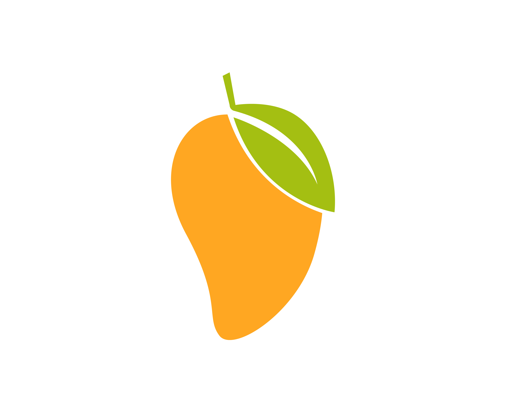

<a id="readme-top"></a>

<!-- Project Shields -->

[![Contributors][contributors-shield]][contributors-url]
[![Forks][forks-shield]][forks-url]
[![Stargazers][stars-shield]][stars-url]
[![Issues][issues-shield]][issues-url]
[![project_license][license-shield]][license-url]

<!-- Project Logo -->
<br />
<div align="center">
        <a href="github.com/ggkkaa/MangOS">
                
        </a>
<h3 align="center">MangOS</h3>
        <p align="center">
                MangOS is a small, open source operating system. It is worked on as a hobby by myself, but if you want to contribute, please do!
        </p>

</div>

<!-- TABLE OF CONTENTS -->

<details>
        <summary>Table of Contents</summary>
        <ol>
        <li>
        <a href="#about-the-project">About The Project</a>
        </li>
        <li>
        <a href="#getting-started">Getting Started</a>
        <ul>
                <li><a href="#prerequisites">Prerequisites</a></li>
                <li><a href="#installation">Installation</a></li>
        </ul>
        </li>
        <li><a href="#usage">Usage</a></li>
        <li><a href="#roadmap">Roadmap</a></li>
        <li><a href="#contributing">Contributing</a></li>
        <li><a href="#license">License</a></li>
        <li><a href="#contact">Contact</a></li>
        <li><a href="#acknowledgments">Acknowledgments</a></li>
        </ol>
</details>

<!-- About the Project -->

## About The Project

<!-- To be added when I can write things: [![Product Name Screen Shot][product-screenshot]](https://example.com) -->

This is a simple OS made by myself to train my C skills.

<p align="right">(<a href="#readme-top">back to top</a>)</p>

<!-- GETTING STARTED -->

## Getting Started

### Requirements

- Docker

- apt

- qemu


### Installation

- Linux/MacOS:

Linux has a build script made specifically for it, to build, just make sure your docker daemon is running, and run
```sh
chmod +x ./build,sh
./build.sh
```

This will also automatically run qemu.

- Windows(CMD):

```sh
docker run --rm -it -v "%cd%":/root/env mangos-buildenv

make iso
```


- Windows(Powershell):

```sh
docker run --rm -it -v "${pwd}:/root/env" mangos-buildenv
```

To build it, run this in your build environment

```sh
make
```

To make an ISO file from this, run

```sh
make iso
```

The ISO file will be found in `./image.iso`.

### Running on real hardware

I'm not sure why you would want to do this, but take the ISO, and use a tool like rufus to
flash it onto a USB. Then, enter your BIOS and set the USB as your boot drive.

### Running on a Virtual Machine

For QEMU, the only supported virtual machine for now, run

```sh
qemu-system-x86_64 -cdrom dist/x86_64/MangOS.iso -serial stdio -m 1024
```

<p align="right">(<a href="#readme-top">back to top</a>)</p>

<!-- ROADMAP -->

## Roadmap

TASKS TO DO

- [x] - Very basic printf that outputs to serial
- [x] - Implement a GDT
- [x] - Implement an IDT
- [x] - Exception handling (i.e. just make an exception handler that prints when errors occur)
- [x] - Basic Log
- [x] - Make a Physical Allocator
- [ ] - Make a page allocator (Bitmap, Page list, whichever one you feel like)
- [ ] - Implement paging using the allocator
- [ ] - Load the new page table
- [ ] -  TSS

<p align="right">(<a href="#readme-top">back to top</a>)</p>

<!-- LICENSE -->

## License

This project is distributed under the MIT License. See `LICENSE.txt` for more information.

<p align="right">(<a href="#readme-top">back to top</a>)</p>

<!-- MARKDOWN LINKS & IMAGES -->
<!-- https://www.markdownguide.org/basic-syntax/#reference-style-links -->

[contributors-shield]: https://img.shields.io/github/contributors/ggkkaa/MangOS.svg?style=for-the-badge
[contributors-url]: https://github.com/ggkkaa/MangOS/graphs/contributors
[forks-shield]: https://img.shields.io/github/forks/ggkkaa/MangOS.svg?style=for-the-badge
[forks-url]: https://github.com/ggkkaa/MangOS/network/members
[stars-shield]: https://img.shields.io/github/stars/ggkkaa/MangOS.svg?style=for-the-badge
[stars-url]: https://github.com/ggkkaa/MangOS/stargazers
[issues-shield]: https://img.shields.io/github/issues/ggkkaa/MangOS.svg?style=for-the-badge
[issues-url]: https://github.com/github_username/repo_name/issues
[license-shield]: https://img.shields.io/github/license/ggkkaa/MangOS.svg?style=for-the-badge
[license-url]: https://github.com/ggkkaa/MangOS/blob/master/LICENSE.txt
[product-screenshot]: images/screenshot.png
[Next.js]: https://img.shields.io/badge/C-000000?style=for-the-badge&logo=nextdotjs&logoColor=white
[Next-url]: https://nextjs.org/
[React.js]: https://img.shields.io/badge/React-20232A?style=for-the-badge&logo=react&logoColor=61DAFB
[React-url]: https://reactjs.org/
[Vue.js]: https://img.shields.io/badge/Vue.js-35495E?style=for-the-badge&logo=vuedotjs&logoColor=4FC08D
[Vue-url]: https://vuejs.org/
[Angular.io]: https://img.shields.io/badge/Angular-DD0031?style=for-the-badge&logo=angular&logoColor=white
[Angular-url]: https://angular.io/
[Svelte.dev]: https://img.shields.io/badge/Svelte-4A4A55?style=for-the-badge&logo=svelte&logoColor=FF3E00
[Svelte-url]: https://svelte.dev/
[Laravel.com]: https://img.shields.io/badge/Laravel-FF2D20?style=for-the-badge&logo=laravel&logoColor=white
[Laravel-url]: https://laravel.com
[Bootstrap.com]: https://img.shields.io/badge/Bootstrap-563D7C?style=for-the-badge&logo=bootstrap&logoColor=white
[Bootstrap-url]: https://getbootstrap.com
[JQuery.com]: https://img.shields.io/badge/jQuery-0769AD?style=for-the-badge&logo=jquery&logoColor=white
[JQuery-url]: https://jquery.com
